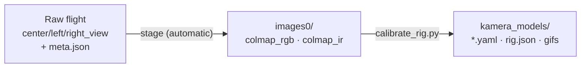
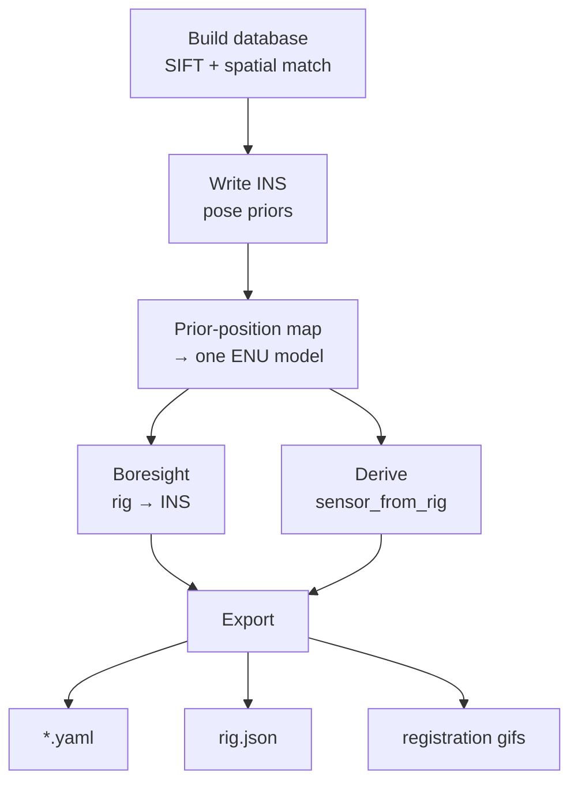
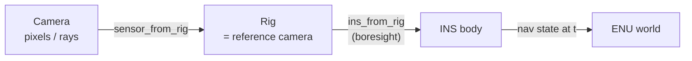

# Camera Rig Calibration

Calibrate a KAMERA camera rig from a raw calibration flight to
per-camera models. For every camera it recovers:

- **intrinsics** — focal length, principal point, OpenCV distortion
  (from COLMAP bundle adjustment); and
- **the mount** — orientation and lever arm relative to the aircraft
  INS, from a single *boresight* solve per modality group.

Outputs: a per-camera `*.yaml`, one self-contained
`<flight>_<date>_<config>_rig.json`, and registration QC gifs.
`TO26Su1_RicesWhale_calibration/fl004` is the running example.



<!-- IMAGE: sparse reconstruction / camera frustums over terrain -->

*The prior-mapped SfM model — camera poses and 3-D points in the INS ENU frame.*

---

## Installation

Same native post-processing setup as the main
[README](README.md#installation): GDAL and pycolmap from conda-forge,
[uv](https://docs.astral.sh/uv/) for the rest. Requires
[conda](https://conda-forge.org/download/); works on Windows and Linux.

```bash
git clone https://github.com/Kitware/kamera.git && cd kamera
conda env create -f environment.yml
conda activate kamera
make install && source .venv/bin/activate   # Linux/macOS
# Windows:  pip install -e .
```

Afterwards `conda activate kamera` is all you need. Conda picks the CUDA
pycolmap build with NVIDIA driver 575+, else CPU. **A GPU only matters
here** — feature extraction/matching over a full flight is slow on CPU.

> The raw flight must contain the INS `*_meta.json` files (one per
> image); everything reads the INS from those, not the `.dat`.

---

## TL;DR

```bash
conda activate kamera
FLIGHT=/Volumes/extreme2tb/TO26Su1_RicesWhale_calibration/fl004

# stage (first run, automatic), build database, map with INS priors,
# boresight, export
python kamera/postflight/scripts/calibrate_rig.py $FLIGHT
```

Outputs land in `$FLIGHT/kamera_models/`. The raw imagery dir is
auto-detected under the flight dir; pass `--raw-dir` if a flight holds
several candidates.

---

## Input: the raw flight

```
fl004/
├── images_21deg_N56RF/     # one folder per camera view
│   ├── center_view/        #   *_C_*_<mod>.jpg + *_C_*_meta.json
│   ├── left_view/          #   *_L_*_<mod>.jpg + ...
│   └── right_view/         #   *_R_*_<mod>.jpg + ...
├── ins_raw/ins_raw_*.dat
└── ..._fl004_log.txt
```

Each view folder holds every image that camera took, in whatever
modalities were flown (`rgb`, `uv`, `ir`, or a mix), each with a
`_meta.json` carrying the INS state at exposure. All cameras are
hardware-synchronized — at each trigger they share one timestamp, which
is how images group into frames. Names encode provenance:

```
TO26Su1_RicesWhale_calibration_fl004_C_20260704_193924.627932_rgb.jpg
└──────────── effort ────────────┘ └flt┘└ch┘└─ date ─┘└── time ──┘└mod┘
```

---

## Step 1 — staging into `images0` (automatic)

The pipeline reads a per-*camera* layout, not the raw per-*view* one.
On its first run against a flight, `calibrate_rig.py` reorganizes it
(by symlink; nothing is copied) into per-modality groups so SIFT never
matches across the EO/IR gap. The same staging is available standalone
— useful to inspect the frame selection before committing to a
calibration run:

```bash
python kamera/postflight/scripts/prepare_flight.py <raw_imagery_dir> <flight_dir>
```

```
fl004/
├── colmap_rgb/images0/          # EO group: rgb + uv
│   ├── 21deg_N56RF_center_rgb/  #   + *_uv folders if flown
│   ├── 21deg_N56RF_left_rgb/
│   └── 21deg_N56RF_right_rgb/
└── colmap_ir/images0/           # IR group, only if ir was flown
```

A group with no imagery simply isn't created (fl004 is RGB, so only
`colmap_rgb`).

Every trigger with a nav time is staged (`--copy` copies instead of
symlinking). Frame density and overlap are set during the flight, not
pared here — SfM needs enough overlap to triangulate, and the binding
constraint is the *lowest-altitude* pass (smallest footprint).

<!-- IMAGE: fl004 trajectory colored by altitude, three figure-8 bands -->

*fl004 — three figure-8 blocks at ~565/435/275 m. All calibration, no transit.*

---

## Step 2 — `calibrate_rig.py`: calibrate

```bash
python kamera/postflight/scripts/calibrate_rig.py <flight_dir>
```

Per modality group, the map fans out to two independent solves that
rejoin at export:



- **Build the database** (if none) — SIFT extraction, one OPENCV camera
  per folder, then **spatial matching** on INS priors (spatial neighbors,
  not every pair).
- **Priors + map** — each image's ENU position at exposure seeds a
  prior-position reconstruction, directly in the INS ENU frame (no
  separate alignment) and resistant to fragmenting.
- **Boresight + `sensor_from_rig`** — a single robust rig-to-INS rotation
  and each camera's rig pose, both recovered from that one model.
- **Export** — a yaml per camera, mount = `ins_from_rig ∘ rig_from_sensor`.

Flags:

| flag | effect |
|------|--------|
| `--reuse-aligned` | reuse an existing `aligned/` model instead of re-mapping (fast) |
| `--save-dir DIR` | output dir (default `<flight_dir>/kamera_models`) |
| `--prior-std M` | INS position prior std, meters (default 2.0) |
| `--groups rgb:colmap_rgb ir:colmap_ir` | override which workspaces run |
| `--no-gifs` / `--num-gifs N` | skip / set QC gifs per camera |
| `--fuse` | cross-modal fusion — see the next section |

A group runs only if its workspace exists, so a flight calibrates
whatever modalities it carries with no extra flags.

---

## Optional — `--fuse`: one multimodal model

By default EO and IR mounts agree only *through the INS*: each group's
boresight resolves to the same physical INS frame, so their relative
mount inherits the INS attitude noise (validated to ~0.01–0.27 deg).
`--fuse` replaces that relay with direct image evidence, using
[MINIMA-LoFTR](https://github.com/LSXI7/MINIMA) — a modality-invariant
deep matcher — to register every IR image straight into the EO model:

```bash
uv sync --group fusion        # one-time: torch + vismatch (weights
                              # auto-download on first run)
python kamera/postflight/scripts/calibrate_rig.py $FLIGHT --fuse
```

Per IR image, its co-located same-trigger EO image is warped into the
IR view (a ground-plane homography from the just-computed per-group
mounts, so the matcher only faces the modality gap, not the ~20x scale
gap), matched, and each matched EO pixel is lifted to 3-D at the
interpolated depth of that EO image's triangulated points. Per-image
PnP only *filters* these correspondences — over near-planar terrain a
single image's pose has a strong tilt/translation ambiguity — and all
surviving matches (tens of thousands) jointly solve **one Sim3**
aligning the IR reconstruction to the EO reconstruction. Every fused IR
pose therefore keeps the IR model's own multi-view relative geometry,
globally registered by the cross-modal matches. The boresight,
`sensor_from_rig`, and export then re-run once on the fused model, so
IR extrinsics are measured against the EO reference camera directly.

The per-group solve still runs first — it supplies the IR intrinsics
and the warp initialization — and any IR camera that fuses too few
frames falls back to its two-boresight calibration with a warning.
Outputs are the same yamls/rig.json (the rig JSON gains a fused
`rgb+ir` group and a `fusion` provenance block) plus a
`fusion_report.json` with per-image match/inlier stats, the model
alignment (rotation, translation, scale, reprojection), and each IR
camera's mount delta vs the two-boresight solution — expect that delta
within the INS-noise band above; a large outlier on one camera flags a
bad fusion.

Tuning flags (defaults are sensible): `--fuse-matcher` (any vismatch
name, e.g. `minima-roma`), `--fuse-pairs-per-ir` (add neighbor-trigger
EO partners), `--fuse-max-dt`, `--fuse-snap-px`, `--fuse-ransac-px`,
`--fuse-min-inliers`, `--fuse-max-images` (smoke runs), `--fuse-ba` /
`--fuse-refine-ir-intrinsics` (optional fused bundle adjustment). A GPU
(CUDA or Apple MPS) makes matching ~6x faster; CPU works.

---

## Outputs

Under `<flight_dir>/kamera_models/`:

```
kamera_models/
├── 21deg_N56RF_center_rgb.yaml          # one per physical camera
├── ...                                  #   (nine for a 3-station EO+UV+IR rig)
├── fl004_20260704_21deg_N56RF_rig.json  # complete rig model
└── registration_gifs/*.gif              # QC
```

**Per-camera yaml** — the runtime model: image size, `fx/fy/cx/cy`,
distortion, `camera_quaternion` (camera→INS mount), `camera_position`.

**Rig JSON** — the authoritative, self-contained mount description:
provenance (flight, date, pycolmap version, git commit); reference frame
(INS body, ENU origin, quaternion convention); per group the boresight,
lever arm, and residual stats; per camera the intrinsics, INS mount, rig
extrinsics (`sensor_from_rig`), reprojection error, and image count.

**Registration gifs** — each non-reference camera flipped against its
colocated reference image warped into its view. Features hold still when
calibrated; jitter means misregistration. The visual acceptance check.

<!-- IMAGE: registration flip gif, e.g. uv vs rgb -->

*UV flipped against RGB warped into its view — ground features stay locked.*

---

## How it works

Each camera's mount composes down a chain of frames:



The cameras are rigidly mounted and synchronized, so the flight maps
onto COLMAP's rig model. Rather than force the rig onto the mapper
(rig-constrained mapping from scratch fragments badly), we map once with
INS priors into one ENU model, then recover the two rig transforms above
in closed form — `sensor_from_rig` by robust averaging over synchronized
frames, and one rig-to-INS **boresight** per group. Because every
group's boresight resolves to the *same physical INS frame*, EO and IR
come out mutually consistent with no cross-modal matching — which is why
this replaces the old per-camera search and IR transfer/keypoint steps.
`--fuse` tightens that INS-relayed link into a measured one by matching
IR images directly into the EO model (see the fusion section above).

---

## Troubleshooting

- **Check the gifs first** — the fastest read on calibration quality.
- **Reprojection error** (rig JSON) is INS-noise-limited (tens of px at
  long EO focals); a health signal, not the accuracy metric. The
  boresight residual (fractions of a degree) and the gifs are.
- **Fragmented model / few images** → the flight was too sparse (not
  enough overlap, especially on the lowest-altitude pass); a
  calibration flight needs dense, overlapping coverage by design.
- **Iterating on boresight/export** without re-mapping → `--reuse-aligned`.
