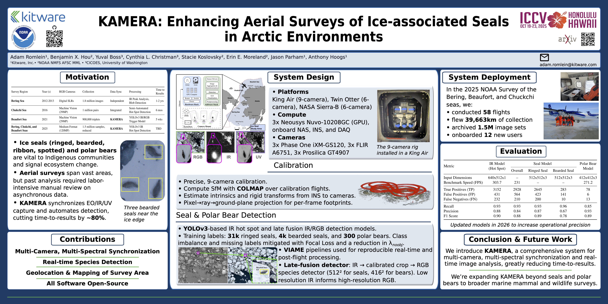

<div align="center">

# KAMERA: Enhancing Aerial Surveys of Ice-associated Seals in Arctic Environments

[](https://arxiv.org/abs/2509.19129)

Welcome to the official repository for KAMERA, an open-source software platform for data collection, management, and analysis. Developed by Kitware in collaboration with NOAA's Marine Mammal Laboratory, KAMERA utilizes synchronized data streams and deep learning to detect and map key marine species like polar bears and ice-associated seals in Arctic and sub-Arctic regions.


</div>

## Overview

KAMERA, or the **K**nowledge-guided Image **A**cquisition **M**anag**ER** and **A**rchiver, integrates the latest in technology with environmental research efforts, offering tightly synchronized data streams and real-time deep learning models to facilitate in-depth data analysis and efficient surveying of marine mammals. This tool is designed to assist researchers, conservationists, and data scientists in collecting and analyzing large-scale geographical and environmental data, enhancing the understanding and conservation of marine ecosystems.

## Features

- **Multi-Camera, Multi-Spectral Synchronization**: All data is collected under a single external time pulse and aggregated into one storage location, meticulously labeled with necessary metadata.
- **Real-time Detection**: Onboard GPUs are used to analyze this synchronized imagery to enable a real-time decision on which data to archive.
- **Mapping**: All imagery and detections are mapped for accurate survey area calculation and post flight data evaluation.
- **Open-Source**: All software has been open-sourced under the Apache License (Version 2.0) and pulls together numerous different off-the-shelf camera drivers and hardware specifications.

## Installation

### Post-processing / flight summaries (native, Windows or Linux)

The binary geo/SfM stack (GDAL, pycolmap) comes from conda-forge
(`environment.yml`); [uv](https://docs.astral.sh/uv/) layers the rest of the
environment into `.venv` on top of it. The only prerequisite is conda
(e.g. [miniforge](https://conda-forge.org/download/)) on your PATH.

Linux/macOS:

```bash
git clone https://github.com/Kitware/kamera.git
cd kamera
conda env create -f environment.yml   # later: conda env update -f environment.yml
conda activate kamera
make install
source .venv/bin/activate
```

Windows (PowerShell) — identical, except `make` usually isn't available, so
run the two commands from the Makefile's `install` target directly:

```powershell
git clone https://github.com/Kitware/kamera.git
cd kamera
conda env create -f environment.yml   # later: conda env update -f environment.yml
conda activate kamera
uv venv --system-site-packages --python=3.10
uv sync --frozen --no-cache
.\.venv\Scripts\Activate.ps1
```

Note for Windows: keep the conda env activated alongside `.venv` so GDAL's
DLLs resolve.

Note on GPU support: conda picks the CUDA build of pycolmap automatically if
your NVIDIA driver supports CUDA >=12.9 (driver 575+); otherwise it silently
falls back to the CPU build. GPU acceleration is only needed for full camera
model calibration — routine post-processing and flight summaries are fine on
the CPU build.

### Docker images

```bash
# Post-processing image (same conda + uv flow as above, containerized):
make postflight
# Builds the core docker images for use in the onboard sytems
make nuvo
# if using VIAME for the DL detectors
make viame
# if using the real-time GUI
make gui
```
Note that these images take up a large amount of disk space, especially the VIAME image which is 30Gb, and it can take several hours to builds. The core images are faster and lighter weight.

## Partners and Acknowledgements
KAMERA was developed in collaboration with the NOAA Marine Mammal Laboratory and the University of Washington.
We thank all contributors who have helped in developing KAMERA, with special thanks to Mike McDermott and Matt Brown who created the core system back in 2018.

## License
This project is licensed under the Apache License 2.0 - see the [LICENSE](LICENSE) for details.

## Contact
For further information, support, or collaboration inquiries, please contact adam.romlein@kitware.com

We hope KAMERA will empower your research and conservation efforts, and we look forward to seeing how you will use this system.

## Citation
If you found this helpful, please cite our paper:
```
@InProceedings{Romlein_2025_ICCV,
    author    = {Romlein, Adam and Hou, Benjamin X. and Boss, Yuval and Christman, Cynthia L. and Koslovsky, Stacie and Moreland, Erin E. and Parham, Jason and Hoogs, Anthony},
    title     = {KAMERA: Enhancing Aerial Surveys of Ice-associated Seals in Arctic Environments},
    booktitle = {Proceedings of the IEEE/CVF International Conference on Computer Vision (ICCV) Workshops},
    month     = {October},
    year      = {2025},
    pages     = {2162-2171}
}
```
