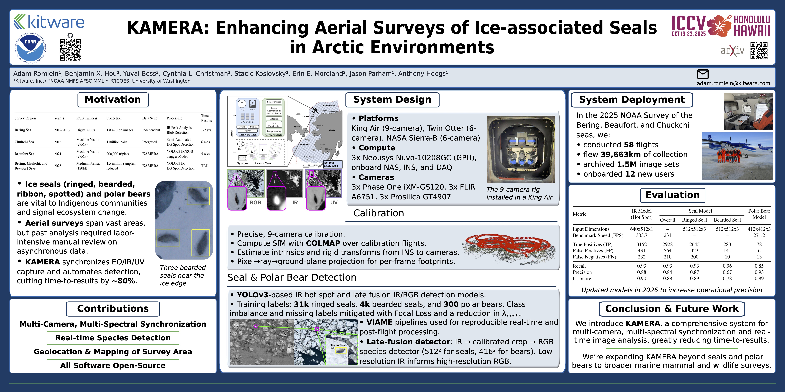

<div align="center">

# KAMERA: Enhancing Aerial Surveys of Ice-associated Seals in Arctic Environments

[](https://arxiv.org/abs/2509.19129)

Welcome to the official repository for KAMERA, an open-source software platform for data collection, management, and analysis. Developed by Kitware in collaboration with NOAA's Marine Mammal Laboratory, KAMERA utilizes synchronized data streams and deep learning to detect and map key marine species like polar bears and ice-associated seals in Arctic and sub-Arctic regions.


</div>

## Overview

KAMERA, or the **K**nowledge-guided Image **A**cquisition **M**anag**ER** and **A**rchiver, integrates the latest in technology with environmental research efforts, offering tightly synchronized data streams and real-time deep learning models to facilitate in-depth data analysis and efficient surveying of marine mammals. This tool is designed to assist researchers, conservationists, and data scientists in collecting and analyzing large-scale geographical and environmental data, enhancing the understanding and conservation of marine ecosystems.

## Features

- **Multi-Camera, Multi-Spectral Synchronization**: All data is collected under a single external time pulse and aggregated into one storage location, meticulously labeled with necessary metadata.
- **Real-time Detection**: Onboard GPUs are used to analyze this synchronized imagery to enable a real-time decision on which data to archive.
- **Mapping**: All imagery and detections are mapped for accurate survey area calculation and post flight data evaluation.
- **Open-Source**: All software has been open-sourced under the Apache License (Version 2.0) and pulls together numerous different off-the-shelf camera drivers and hardware specifications.

## Layout

- `src/` is the onboard software: ROS packages for the cameras, INS, DAQ and processing, under `src/core`, `src/cams` and `src/process`.
- `src/cfg/` is the per-system configuration. `nayak/` and `taiga/` each hold a `config.yaml`, the default system state, and one folder per host with its network and clock settings. Files shared by every system sit at the top level. The file `~/kw/SYSTEM_NAME` on a host picks which folder applies.
- `runtime/` is how a host runs the system: the env script, the supervisor program definitions for the leader and the followers, and the scripts supervisor calls (tmux startup). It is the same on every system.
- `compose/` runs and `docker/` defines the images built for the containers those programs start.
- `provision/` sets up a host from a fresh install with Ansible, plus the desktop shortcuts and dotfiles it installs.
- `scripts/` holds operator tools such as `kamera_run.sh` and `kamera_halt.sh`.
- `kamera/` is the Python package for post-processing, including the rig calibration.
- `docs/` holds notes that do not belong next to code.

## Installation

### Post-processing (native, Windows or Linux)

GDAL and pycolmap come from conda-forge (Python 3.13); [uv](https://docs.astral.sh/uv/)
installs the rest into `.venv` from the lockfile. Requires conda:
[Miniforge](https://conda-forge.org/download/) is recommended since it defaults to the
conda-forge channel these packages come from, but
[Miniconda](https://www.anaconda.com/download/success) or a full Anaconda install also
work because `environment.yml` pins the channel. The same steps work on Linux, macOS
and Windows (PowerShell or Miniforge/Anaconda Prompt):

```bash
git clone https://github.com/Kitware/kamera.git
cd kamera
python bootstrap.py
conda activate kamera
source .venv/bin/activate        # Windows: .venv\Scripts\activate
```

`bootstrap.py` creates the `kamera` conda env from `environment.yml` (or updates it
if it exists) and builds `.venv` on top of it; `make install` does the same on Linux.
Pass `--name` to build a second env beside an existing one. Afterwards, activating
the conda env and then `.venv` is all you need. Conda installs the CUDA build of
pycolmap automatically with NVIDIA driver 575+ (CUDA 12.9), otherwise the CPU build;
GPU only matters for full camera model calibration.

### Rig calibration

`kamera-calibrate <flight_dir>` calibrates every camera on the rig from a calibration
flight and writes camera models, the rig geometry, DIVE registration files and a PDF
report. See [kamera/calibration/README.md](kamera/calibration/README.md).

### Docker images

```bash
# post-processing / flight summary image
make postflight
# Builds the core docker images for use in the onboard sytems
make core
# if using VIAME for the DL detectors
make viame
# if using the real-time GUI
make gui
```
Note that these images take up a large amount of disk space, especially the VIAME image which is 30Gb, and it can take several hours to builds. The core images are faster and lighter weight.

## Partners and Acknowledgements
KAMERA was developed in collaboration with the NOAA Marine Mammal Laboratory and the University of Washington.
We thank all contributors who have helped in developing KAMERA, with special thanks to Mike McDermott and Matt Brown who created the core system back in 2018.

## License
This project is licensed under the Apache License 2.0 - see the [LICENSE](LICENSE) for details.

## Contact
For further information, support, or collaboration inquiries, please contact adam.romlein@kitware.com

We hope KAMERA will empower your research and conservation efforts, and we look forward to seeing how you will use this system.

## Citation
If you found this helpful, please cite our paper:
```
@inproceedings{Romlein_2025,
   title={KAMERA: Enhancing Aerial Surveys of Ice-Associated Seals in Arctic Environments},
   url={http://dx.doi.org/10.1109/ICCVW69036.2025.00228},
   DOI={10.1109/iccvw69036.2025.00228},
   booktitle={2025 IEEE/CVF International Conference on Computer Vision Workshops (ICCVW)},
   publisher={IEEE},
   author={Romlein, Adam and Hou, Benjamin X. and Boss, Yuval and Christman, Cynthia L. and Koslovsky, Stacie and Moreland, Erin E. and Parham, Jason and Hoogs, Anthony},
   year={2025},
   month=Oct, pages={2183–2192} }
```
